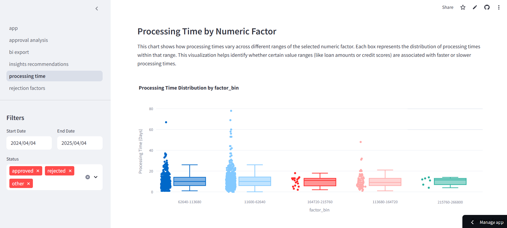

# Loan Origination Data Analysis Platform


A comprehensive Streamlit-based platform for analyzing loan application data, providing insights into approval rates, processing times, and rejection factors.

## Features

- **Data Upload & Processing**: Support for CSV and Excel files with automatic column mapping
- **Sample Data**: Built-in sample dataset for platform exploration
- **Interactive Analysis Pages**:
  - Approval Rate Analysis
  - Processing Time Analysis 
  - Rejection Factors Analysis
  - Insights & Recommendations
- **Business Intelligence Integration**: Export capabilities for various BI tools

## Project Structure

```
├── pages/
│   ├── approval_analysis.py     # Approval rate trends and factors
│   ├── processing_time.py       # Processing time analysis
│   ├── rejection_factors.py     # Rejection analysis
│   ├── insights_recommendations.py  # Automated insights
│   └── bi_export.py            # BI tool integration
├── utils/
│   ├── utils.py                # Helper functions
│   └── visualization.py        # Data visualization
├── app.py                      # Main application
├── data_processor.py           # Data processing logic
├── statistics.py               # Statistical analysis
└── bi_integration.py           # BI integration utilities
```

## Usage

1. **Data Upload**
   - Upload CSV or Excel file containing loan application data
   - Use sample data to explore platform capabilities
   - Automatic column mapping with manual override options

2. **Analysis Features**
   - Track approval rates over time
   - Identify processing bottlenecks
   - Analyze rejection patterns
   - Generate actionable insights

3. **Data Export**
   - Export analysis in Excel, CSV, or PDF formats
   - Integration with BI tools
   - Custom query support

## Data Requirements

Your data should include these columns (names can vary):
- Application ID (unique identifier)
- Application Date
- Decision Date
- Status (approved/rejected)
- Loan Amount
- Applicant Details (income, credit score, etc.)
- Rejection Reason (if applicable)

## Key Metrics

1. **Approval Analysis**
   - Overall approval rate
   - Approval trends
   - Factor correlation analysis

2. **Processing Time**
   - Average processing time
   - Processing time distribution
   - Bottleneck identification

3. **Rejection Analysis**
   - Common rejection reasons
   - Risk factor analysis
   - Rejection patterns

4. **Automated Insights**
   - Trend detection
   - Performance recommendations
   - Process optimization suggestions
